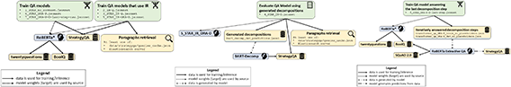

# Did Aristotle Use a Laptop? A Question Answering Benchmark with Implicit Reasoning Strategies

This repository contains the official code of the paper: ["Did Aristotle Use a Laptop? A Question Answering Benchmark with Implicit Reasoning Strategies"](https://arxiv.org/abs/2101.02235), accepted for publication in Transactions of the Association for Computational Linguistics (TACL), 2021.


### Citation
```
@article{geva2021strategyqa,
  title = {{Did Aristotle Use a Laptop? A Question Answering Benchmark with Implicit Reasoning Strategies}},
  author = {Geva, Mor and Khashabi, Daniel and Segal, Elad and Khot, Tushar and Roth, Dan and Berant, Jonathan},
  journal = {Transactions of the Association for Computational Linguistics (TACL)},
  year = {2021},
}
```

Following are instructions to reproduce the experiments reported in the paper, on the [StrategyQA dataset](https://allenai.org/data/strategyqa).

***

## Quick Links
1. [Setup](#setup)
2. [Training](#training)
3. [Prediction and Evaluation](#prediction-and-evaluation)
4. [Download Links to Our Trained Models](#download-links-to-our-trained-models)

*** 
## Setup

### Requirements

Our experiments were conducted in a Python 3.7 environment.
To clone the repository and set up the environment, please run the following commands:
```
git clone https://github.com/eladsegal/strategyqa.git
cd strategyqa
pip install -r requirements.txt
```


### StrategyQA dataset files
The official StrategyQA dataset files with a detailed description of their format can be found on the [dataset page](https://allenai.org/data/strategyqa).  
To train our baseline models, we created a 90%/10% random split of the official train set to get an *unofficial* train/dev split: `data/strategyqa/[train/dev].json`.  


### (Optional) Creating an Elasticsearch index of our corpus 
Download link to our full corpus of Wikipedia paragraphs is available on the [dataset page](https://allenai.org/data/strategyqa).
A script for indexing the paragraphs into Elasticsearch is available [here](elasticsearch_index).


***

## Training

* In scripts with GPU, replace it with a GPU, a list of GPUs or -1 for CPU.

* Download links to our trained models are provided in  [Links to our Trained Models](#download-links-to-our-trained-models).

### RoBERTa*

RoBERTa* is a RoBERTa model fine-tuned on auxiliary datasets that we used as our base model when fine-tuning on StrategyQA. We trained RoBERTa* as follows:

1. Download [twentyquestions dataset](https://github.com/allenai/twentyquestions) and extract it to `data/`, so you have `data/twentyquestions/twentyquestions-[train/dev].jsonl`.

2. Download [BoolQ dataset](https://github.com/google-research-datasets/boolean-questions) and extract it to `data/`, so you have `data/boolq/[train/dev].jsonl`.

3. ```
    python run_scripts/train_RoBERTa_STAR.py -s OUTPUT_DIR -g "GPU"
    ```

    A trained RoBERTa* model can be found [here](https://storage.googleapis.com/ai2i/strategyqa/models/2_boolq.tar.gz).

### Question Answering Models
The directory `configs/strategy_qa` containes configuration files for the question answering models described in the paper. 
To train a question answering model of a specific configuration, run the `train.py` script as follows:
```
python run_scripts/train.py --config-file configs/strategy_qa/CONFIG_NAME.jsonnet -s OUTPUT_DIR -g "GPU" -w [path to a RoBERTa* model (.tar.gz file)]
```
A trained model for each configuration can be found in https://storage.googleapis.com/ai2i/strategyqa/models/CONFIG_NAME.tar.gz,  
and evaluation scores for it on the used dev set ([Setup](#setup)) can be found in https://storage.googleapis.com/ai2i/strategyqa/models/CONFIG_NAME.json.

Figures depicting the resource dependency of the training procedures can be found [here](graphs).

[](graphs)

Notes:
* Configurations with "base" in their name are not runnable on their own.  

* Models that query the Elasticsearch server won't be able to get results for queries that aren't already in `data/queries_cache.json`, unless an Elasticsearch server is set up and referred to in `src/data/dataset_readers/utils/elasticsearch_utils.py`. See more details on setting up an Elasticsearch index in [Setup](#setup).

* The config `4_STAR_IR-D.jsonnet` is not trainable, but used only for evaluation of `5_STAR_IR-ORA-D.jsonnet` with decompositions generated with `BART-Decomp`.  
It requires `data/strategyqa/generated/bart_decomp_dev_predictions.jsonl`, see [Question Decomposition Model - BART-Decomp](#question-decomposition-model-bart-decomp) to learn how to generate it. A dependency graph can be found [here](graphs/graph2.png).  
To create an AllenNLP model archive for it, run the following:
    ```
    python tools/tar_to_tar.py [path to a 5_STAR_IR-ORA-D model (.tar.gz file)] configs/4_STAR_IR-D.jsonnet 4_STAR_IR-D.tar.gz
    ```

* The config `8_STAR_ORA-P-D-last-step.jsonnet` requires `data/strategy_qa/transformer_qa_ORA-P_[train/dev]_no_placeholders.json`, see [Iterative Answering of Decompositions](#iterative-answering-of-decompositions) to learn how to generate it. A dependency graph can be found [here](graphs/graph3.png).

### Question Decomposition Model (BART-Decomp)
1. Train the model:  
    ```
    python run_scripts/train.py --config-file configs/decomposition/bart_decomp_strategy_qa.jsonnet -s OUTPUT_DIR -g "GPU"
    ```
    A trained model can be found [here](https://storage.googleapis.com/ai2i/strategyqa/models/bart_decomp_strategy_qa.tar.gz).


2. Output predictions:  
    ```
    python run_scripts/predict.py --model [path to a BART-Decomp model (.tar.gz file)] --data data/strategyqa/dev.json -g "GPU" --output-file data/strategyqa/generated/bart_decomp_dev_predictions.jsonl
    ```

### Iterative Answering of Decompositions
1. Download [BoolQ dataset](https://github.com/google-research-datasets/boolean-questions) and extract it to `data/`, so you have `data/boolq/[train/dev].jsonl`.

2. Download [SQuAD 2.0 dataset](https://rajpurkar.github.io/SQuAD-explorer/) and extract it to `data/`, so you have `data/squad_v2/[train/dev]-v2.0.json`.

3. Append BoolQ to SQuAD:
    ```
    python -m tools.squadify_boolq data/boolq/train.jsonl data/squad/squad_v2_boolq_dataset_train.json --append-to data/squad/train-v2.0.json
    ```
    ```
    python -m tools.squadify_boolq data/boolq/dev.jsonl data/squad/squad_v2_boolq_dataset_dev.json --append-to data/squad/dev-v2.0.json
    ```

4. Train a RoBERTa Extractive QA model on SQuAD and BoolQ:  
    ```
    python run_scripts/train.py --config-file configs/squad/transformer_qa_large.jsonnet -s OUTPUT_DIR -g "GPU"
    ```
    A trained model can be found [here](https://storage.googleapis.com/ai2i/strategyqa/models/transformer_qa_large.tar.gz).


5. Replace the placeholders in the gold decomposition:
    ```
    python -m src.models.iterative.run_model -g [GPU (single only)] --qa-model-path ../experiments/publish/transformer_qa_large.tar.gz --paragraphs-source ORA-P --data data/strategyqa/train.json --output-predictions-file data/strategyqa/generated/transformer_qa_ORA-P_train_no_placeholders.json
    ```
    ```
    python -m src.models.iterative.run_model -g [GPU (single only)] --qa-model-path ../experiments/publish/transformer_qa_large.tar.gz --paragraphs-source ORA-P --data data/strategyqa/dev.json --output-predictions-file data/strategyqa/generated/transformer_qa_ORA-P_dev_no_placeholders.json
    ```
    This script allows for different paragraphs sources to be used (IR-Q/ORA-P/IR-ORA-D/IR-D), and can also work on generated decompositions instead of the gold ones (use --generated-decompositions-paths).  

***

## Prediction and Evaluation

The **StrategyQA leaderboard** is available [here](https://leaderboard.allenai.org/strategyqa/).

The official evaluation script can be found [here](https://github.com/allenai/strategyqa-evaluator).

### Question Answering
- Evaluate accuracy:
    ```
    python run_scripts/evaluate.py --model [path to a QA model (.tar.gz file)] --data DATA_PATH -g "GPU"
    ```
- Output predictions:  
    ```
    python run_scripts/predict.py --model [path to a QA model (.tar.gz file)] --data DATA_PATH -g "GPU" --output-file OUTPUT_PATH.jsonl
    ```

### Recall@10
1. Outputs the retrieved paragraphs for the configuration.  
    The format is a dictionary with "qid" as a key and a list of paragraph IDs as the value.
    ```
    python ir_evaluation/get_paragraphs_by_config.py --config-file configs/CONFIG_NAME.jsonnet --output-file OUTPUT_PATH --data DATA_PATH
    ```

2. 
    ```
    python ir_evaluation/recall@10.py --data DATA_PATH --retrieved-paragraphs [OUTPUT_PATH from the previous step]
    ```
***

## Download Links to Our Trained Models

* **RoBERTa\***: [link](https://storage.googleapis.com/ai2i/strategyqa/models/2_boolq.tar.gz)
* **RoBERTa\*-no_context**: [link](https://storage.googleapis.com/ai2i/strategyqa/models/1_STAR_no_context.tar.gz)
* **RoBERTa-IR-Q**: [link](https://storage.googleapis.com/ai2i/strategyqa/models/2_IR-Q.tar.gz)
* **RoBERTa\*-IR-Q**: [link](https://storage.googleapis.com/ai2i/strategyqa/models/3_STAR_IR-Q.tar.gz)
* **RoBERTa\*-IR-D**: [link](https://storage.googleapis.com/ai2i/strategyqa/models/4_STAR_IR-D.tar.gz)
* **RoBERTa\*-IR-ORA-D**: [link](https://storage.googleapis.com/ai2i/strategyqa/models/5_STAR_IR-ORA-D.tar.gz)
* **RoBERTa\*-ORA-P**: [link](https://storage.googleapis.com/ai2i/strategyqa/models/6_STAR_ORA-P.tar.gz)
* **RoBERTa\*-ORA-P-D-last-step-raw**: [link](https://storage.googleapis.com/ai2i/strategyqa/models/7_STAR_ORA-P-D-last-step-raw.tar.gz)
* **RoBERTa\*-ORA-P-D-last-step**: [link](https://storage.googleapis.com/ai2i/strategyqa/models/8_STAR_ORA-P-D-last-step.tar.gz)
* **BART-Decomp**: [link](https://storage.googleapis.com/ai2i/strategyqa/models/bart_decomp_strategy_qa.tar.gz)
